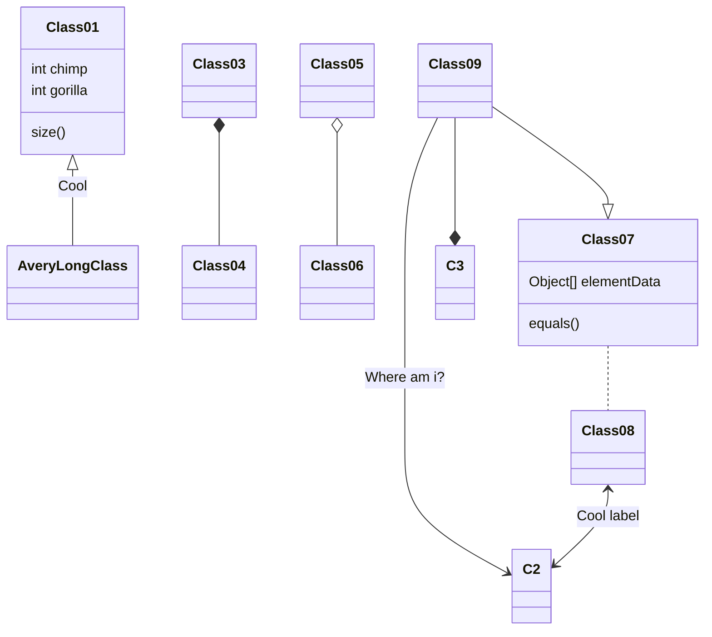

+++
title = 'C++'
date = 2024-03-09T14:41:59+05:30
draft = false
+++

Linux distribution mainly consists of the following components
- Boot Loader
- Init System
- Display Renderer
- Display Manager
- Display Environments
- Package Managers

All Linux Distros differ based on these 3 components
- Debian Linux -> Debian uses a stable release cycle and generally has older packages, but they don’t usually have many bugs and are very reliable. This is typically my go to for desktops I don’t change much.
	- Bootloader - GRUB
	- Init System - systemd
	- Display Render - Xorg
	- Display Manager - SDDM/GDM
	- Desktop Environment - KDE/GNOME
	- Package Manager - APT


- Arch Linux
- Fedora Linux -> This is a RHEL (Red Hat Enterprise Linux) based distribution. It strikes a balance between newer packages and Linux kernels between Debian and Arch. Its not as new as Arch, but not as old as Debian. It has different SPINS but its main download uses the following:
	- Bootloader - Systemd
	- Init System - systemd
	- Display Render - Wayland
	- Desktop Environment - GNOME
	- Package Manager - DNF




rest test

```mermaid
<div class="mermaid" style="width: 100%; height: auto; max-width: 100%; font-size: 16px;">
    
    graph TD;
        A-->B;
        A-->C;
        B-->D;
        C-->D;
</div>


```
test agian

```goat 
      .               .                .               .--- 1          .-- 1     / 1
     / \              |                |           .---+            .-+         +
    /   \         .---+---.         .--+--.        |   '--- 2      |   '-- 2   / \ 2
   +     +        |       |        |       |    ---+            ---+          +
  / \   / \     .-+-.   .-+-.     .+.     .+.      |   .--- 3      |   .-- 3   \ / 3
 /   \ /   \    |   |   |   |    |   |   |   |     '---+            '-+         +
 1   2 3   4    1   2   3   4    1   2   3   4         '--- 4          '-- 4     \ 4

```

\[
\begin{aligned}
KL(\hat{y} || y) &= \sum_{c=1}^{M}\hat{y}_c \log{\frac{\hat{y}_c}{y_c}} \\
JS(\hat{y} || y) &= \frac{1}{2}(KL(y||\frac{y+\hat{y}}{2}) + KL(\hat{y}||\frac{y+\hat{y}}{2}))
\end{aligned}
\]